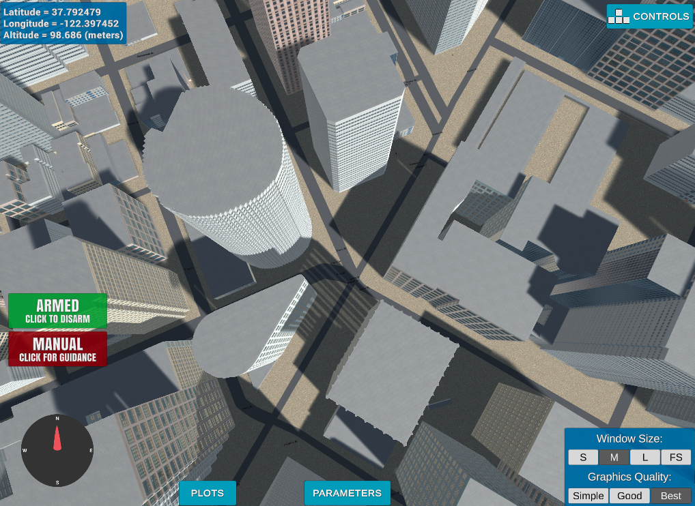

# FCND - 3D Motion Planning

In this project you will integrate the techniques that you have learned throughout the last several lessons to plan a path through an urban environment. Check out the project rubric for more detail on what constitutes a passing submission.

In this project, we will implement Path Planning Algorithm. To do this, we will complete six tasks: 
1. Load the 2.5D map in the colliders.csv file describing the environment.
2. Discretize the environment into a grid or graph representation.
3. Define the start and goal locations. You can determine your home location from self._latitude and self._longitude.
4. Perform a search using A* or other search algorithm.
5. Use a collinearity test or ray tracing method (like Bresenham) to remove unnecessary waypoints.
6. Return waypoints in local ECEF coordinates (format for self.all_waypoints is [N, E, altitude, heading], where the drone’s start location corresponds to [0, 0, 0, 0]).

## [Rubric](https://review.udacity.com/#!/rubrics/1534/view) Points
### Here I will consider the rubric points individually and describe how I addressed each point in my implementation.  

---

#### 1. Explain the functionality of what's provided in `motion_planning.py` and `planning_utils.py`
These scripts contain a basic planning implementation that includes...

And here's a lovely image of my results (ok this image has nothing to do with it, but it's a nice example of how to include images in your writeup!)

Here's | A | Snappy | Table
--- | --- | --- | ---
1 | `highlight` | **bold** | 7.41
2 | a | b | c
3 | *italic* | text | 403
4 | 2 | 3 | abcd

### Implementing Your Path Planning Algorithm

#### 1. Set your global home position
Here students should read the first line of the csv file, extract lat0 and lon0 as floating point values and use the self.set_home_position() method to set global home. Explain briefly how you accomplished this in your code.

And here is a lovely picture of our downtown San Francisco environment from above!

#### 2. Set your current local position
Here as long as you successfully determine your local position relative to global home you'll be all set. Explain briefly how you accomplished this in your code.

Meanwhile, here's a picture of me flying through the trees!

#### 3. Set grid start position from local position
we read the first line of the csv file, extract lat0 and lon0 as floating point values and use the self.set_home_position() method to set global home.
This is implemented in plan_path() function lines 147-148.

#### 4. Set grid goal position from geodetic coords
This step is to add flexibility to the desired goal location. we are able to choose any (lat, lon) within the map and have it rendered to a goal location on the grid.
This is implemented in plan_path() function lines 124-128.

#### 5. Modify A* to include diagonal motion (or replace A* altogether)
Minimal requirement here is to modify the code in planning_utils() to update the A* implementation to include diagonal motions on the grid that have a cost of sqrt(2), but more creative solutions are welcome. Explain the code you used to accomplish this step.
A* search is an extension of the cost search you implemented. A heuristic function is used in addition to the cost penalty. Thus if the setup is:

* c is the current cost
* g is the cost function
* h is the heuristic function

Then the new cost is c_new = c + g() + h().
The difference between g and h is that g models the cost of performing actions, irrespective of the environment, while $h$ models the cost based on the environment, i.e., the distance to the goal.
The A* algorithm is implemented following this steps:
- start with the start position in the queue 
- keep checking neighbours cells
- If the node has not been visited you will need to
    1. Mark it as visited
    2. Add it to the queue
    3. Add how you got there to branch
- will choose the node with the least cost.
- when we reach the goal, we break from the search
- backtrack the steps till we reached the start location. 

The issue with A* is it's very computational expensive. when we wanted to move to a goal with a very far distance. it almost took an hour to calculate it's path.   

#### 6. Cull waypoints 
For this step, we used collinearity. The idea is simply to prune your path of unnecessary waypoints.
The implementaion follow the following steps:
- copy the points in the path
- loop for the points in copied path (we move point by point)
- start with the first three point calculate their collinearity if it's true remove the middle point
- when the points are finished we return the remaining points.

### Execute the flight
#### 1. Does it work?
It works!

### Double check that you've met specifications for each of the [rubric](https://review.udacity.com/#!/rubrics/1534/view) points.
  
# Extra Challenges: Real World Planning

For an extra challenge, consider implementing some of the techniques described in the "Real World Planning" lesson. You could try implementing a vehicle model to take dynamic constraints into account, or implement a replanning method to invoke if you get off course or encounter unexpected obstacles.

